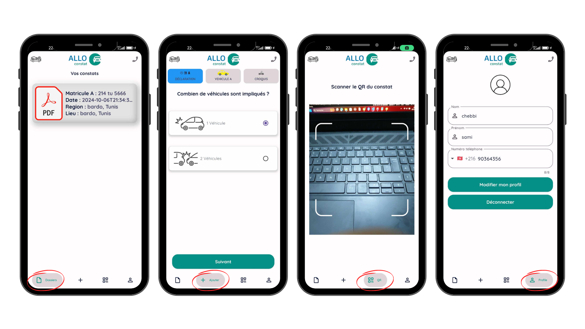

# Digital Automobile Accident Reporting App


## Description

Allo Constat digitizes automobile accident reports. Users can fill in required fields, upload vehicle documents, and take car photos from 8 angles to generate a PDF report, which is sent to Tunisie Constat. A copy of the report can be shared with the other party via QR code.


## Screenshot





## Tech Stack
- **Flutter**: For building cross-platform mobile applications.
- **Dart**: The programming language used for Flutter apps.
- **Node.js**: A JavaScript runtime built on Chrome's V8 engine, used for building the backend API.
- **Express.js**: A web framework for Node.js, used to create a RESTful API for handling HTTP requests.
- **MongoDB**: A NoSQL database used to store application data in a flexible and scalable way.

## How to Run

### Apps Setup:

1. Clone the repository:
   ```bash
   git clone https://github.com/ChebbiYahya/allo_constat.git

2. Navigate to the project directory:
   ```bash
   cd allo_constat_front

3. Install dependencies:
   ```bash
   flutter pub get

4. Run the app:
   ```bash
   flutter run

### Run Backend:

1. Navigate to the backend directory:
   ```bash
   cd AlloConstat-Backend-master

2. Install backend dependencies:
   ```bash
   npm install

3. Start the Node.js server:
   ```bash
   npm start

4. The backend will now run on:
   ```bash
   http://localhost:3000
